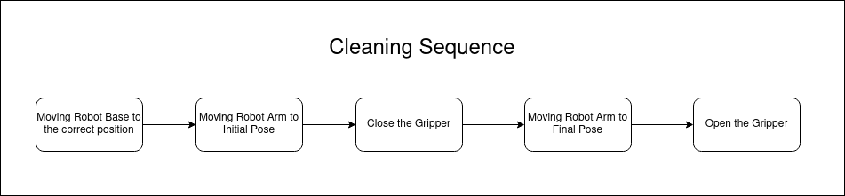

# Introduction
The demo video can be found [here](./assets/demo.mp4).

# Design
Below shows the architecture of the solution, which comprises three main components: moving of the robot base, moving of the robot arm, and moving of the gripper.


The entire cleaning sequence is then broken down into 5 steps:
- Moving to the Robot Base to the correct position where the toilet bowl is located.
- Moving the Robot Arm to the pose where the toilet seat is located (initial pose).
- Closing of the Robot Arm's gripper.
- Moving the Robot Arm to final pose of the toilet seat.
- Opening of the Robot Arm's gripper.   

The robot base navigation is based on [move_base](http://wiki.ros.org/move_base), and localization is based on [amcl](http://wiki.ros.org/amcl) ; The robot arm's planning and movement is based on [moveit](https://moveit.ros.org/).

### Configuration
In order to make this a more generalized sequence, the `cleaning_sequence` node takes in a configuration file shown below:
```yaml
move_base_goal:
  x: 4
  y: 3
  yaw: 90 # in degrees

initial_end_effector_pose:
  position:
    x: 1.
    y: 0.
    z: 0.
  orientation:
    x: 0.
    y: 0.
    z: 0.
    w: 1.

final_end_effector_pose:
  position:
    x: 1.
    y: 0.
    z: 0.
  orientation:
    x: 0.
    y: 0.
    z: 0.
    w: 1.
```
This is so that the robot's behavior can be modified in run-time without having to re-compile. 

# Set Up
1. Installing Pre-requisites
    ```sh
    sudo apt-get install ros-noetic-husky-* \
        && ros-noetic-ddynamic-reconfigure \
        && ros-noetic-imu-filter-madgwick \
        && ros-noetic-imu-transformer
    ```
2. Rosdep Install
    ```sh
    rosdep install --from-paths src --ignore-src -r -y
    ```
2. Building
    ```sh
    catkin build
    ```
3. Launching
    ```sh
    # Gazebo
    roslaunch cleaning_sequence bringup.sh

    # Arm Planning & Base Navigation
    roslaunch cleaning_sequence planning_and_navigation.launch
    
    # Run cleaning_sequence
    roslaunch cleaning_sequence cleaning_sequence.launch
    ```